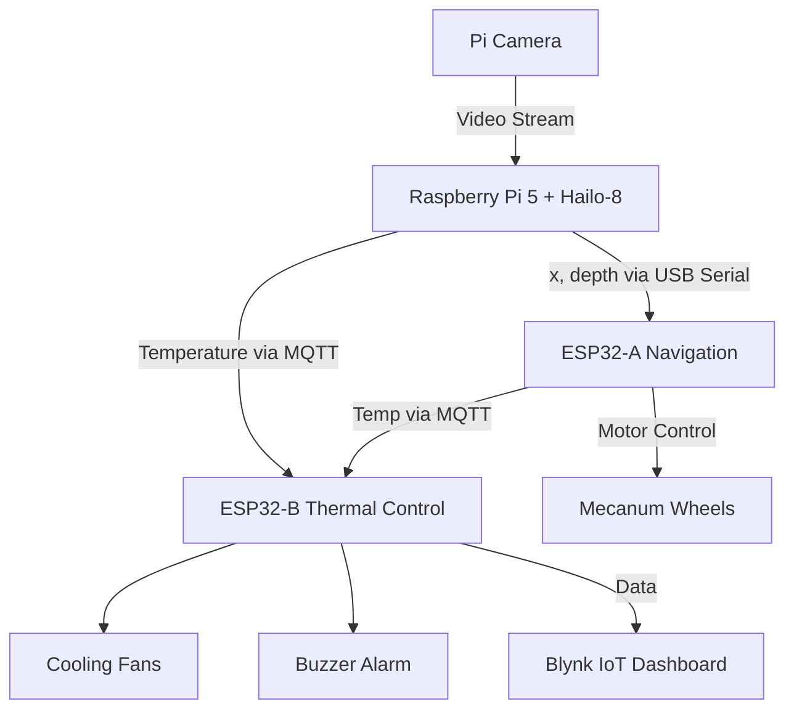

# Autonomous-Navigation-IoT-Robot-with-Vision-Thermal-Sensing-and-Control


**ThermoVision** is a modular IoT robot that navigates using vision and acts based on temperature. It combines a Raspberry Pi 5 (with a Hailo-8 AI accelerator) for real-time image processing and depth estimation, an ESP32‑A microcontroller for driving a mecanum-wheeled chassis, and an ESP32‑B microcontroller for thermal control (fans, buzzer) and remote monitoring via Blynk.

The Pi runs a parallel pipeline of a YOLOv8-Nano object detector and SCDepthV3 monocular depth estimator; it sends the detected object’s horizontal position (x-coordinate) and depth over USB serial to ESP32-A. The Pi also reads an MLX90614 IR thermometer to measure object temperature and publishes it via MQTT. ESP32-A aligns and drives the robot toward the object (using the 4-omnidirectional mecanum wheels) and relays temperature data. ESP32-B subscribes to the temperature MQTT topic to activate fans or a buzzer if thresholds are exceeded, and displays real-time data on a Blynk dashboard.

---

## System Architecture



---

## Hardware Components

- **Raspberry Pi 5** + **Hailo-8 AI HAT**
- **Pi Camera**
- **ESP32-A** (Navigation)
- **ESP32-B** (Thermal Control)
- **Mecanum Wheels x4** + motor driver (L298N or similar)
- **MLX90614 IR Temperature Sensor**
- **DHT11 Sensor** (backup)
- **Cooling Fans**
- **Buzzer Alarm**

---

## Repository Structure

```
ThermoVision/
├── RaspberryPi5-AIHAT/
│   ├── image_pipeline.py
│   ├── requirements.txt
│   └── models/
├── ESP32-A/
│   └── navigation.ino
├── ESP32-B/
│   └── thermal_control.ino
├── docs/
│   └── architecture.png
├── LICENSE
└── README.md
```

---

## Setup Instructions

### Raspberry Pi 5 + AI HAT
- Install dependencies: `pip install -r requirements.txt`
- Connect Pi Camera & MLX90614
- Run pipeline: `python3 image_pipeline.py`

### ESP32-A
- Flash `navigation.ino` with Arduino IDE/PlatformIO
- Connect to motor driver + MLX90614

### ESP32-B
- Flash `thermal_control.ino`
- Configure Wi-Fi & Blynk token
- Wire fans, buzzer, DHT11

### MQTT Broker
- Run Mosquitto broker on Pi or local server
- Topics: `thermovision/temperature`

---

## Running the System

1. Power Raspberry Pi and both ESP32 boards.
2. Start `image_pipeline.py` on Pi.
3. ESP32-A navigates toward detected objects.
4. ESP32-B controls fans/buzzer and updates Blynk dashboard.

---

## Example Outputs

- **YOLO Detection:** Bounding boxes with labels on objects.
- **Depth Estimation:** Stabilized depth values with ±0.5cm variance.
- **Blynk Dashboard:** Displays temperature readings and fan status in real time.

---

## License

This project is licensed under the **MIT License**. See [LICENSE](LICENSE) for details.

---

## Contributors

- **Durrani Hakim**  
- **Arraziq Faizal**  
- **Nisha Adlin**  
- **Dr. Norashikin**  
