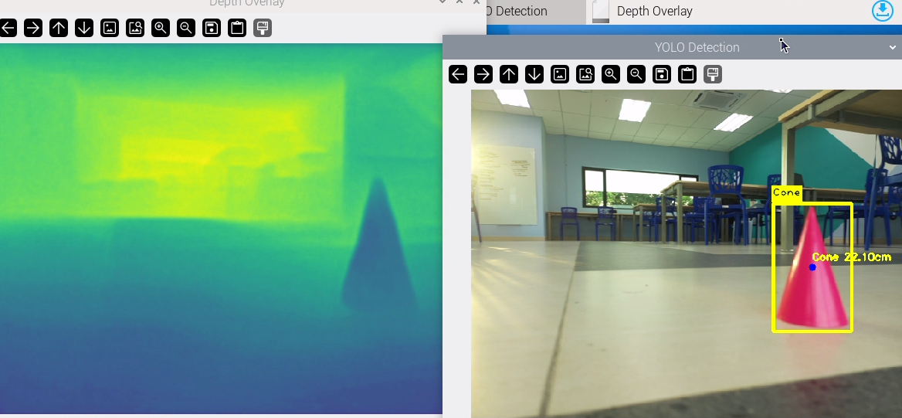
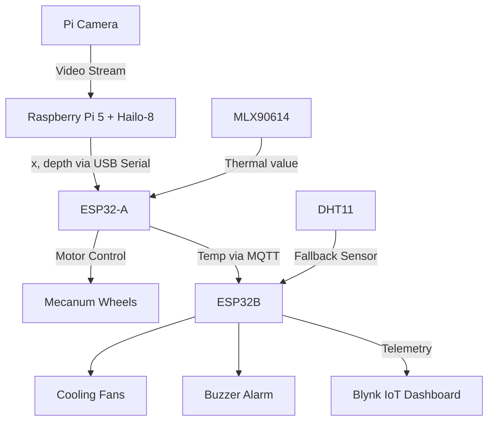

# ThermoVision



**ThermoVision** is a modular IoT robot designed for **autonomous navigation, vision-based object detection, and temperature-based actuation**. It integrates three major subsystems:

1. **Raspberry Pi 5 + Hailo-8 AI HAT**: Runs real-time vision and depth estimation using YOLOv8-Nano and SCDepthV3, communicates with ESP32-A via USB serial, and publishes temperature readings via MQTT.
2. **ESP32-A (Navigation Controller)**: Receives alignment and depth data, controls mecanum wheels for omnidirectional navigation, and relays temperature readings.
3. **ESP32-B (Thermal Control)**: Subscribes to MQTT temperature data, activates fans and buzzer alarms, and publishes monitoring data to a Blynk IoT dashboard. Includes a DHT11 fallback sensor.

---

## 📐 System Architecture



---

## 🛠 Hardware Components

- **Raspberry Pi 5** with power supply (2P 18650 High Discharge Battery + TPS61088 5V Boost Converter)
- **Hailo-8 AI HAT** for AI acceleration
- **Raspberry Pi Camera**
- **ESP32-A** (navigation) 
- **ESP32-B** (thermal control)
- **Mecanum Wheels x4** + **Motor Driver (e.g. TB6612FNG)** + Power Supply (2S 18650 Battery)
- **MLX90614 IR Temperature Sensor** (I²C)
- **DHT11 Temperature/Humidity Sensor** (fallback)
- **Cooling Fans**
- **Buzzer Alarm**
- **Miscellaneous:** wiring, breadboards/PCB, batteries or DC power supply

---

## 📂 Repository Structure

```
ThermoVision/
├── RaspberryPi5-AIHAT/
│   ├── requirements.txt         # Dependencies
│   ├── models/                  # Main Python script (YOLO + SCDepth + Serial + MQTT) 
│   └── utils/                   # Helper functions
│
├── ESP32-A/
│   └── navigation.ino           # Navigation firmware (Arduino/PlatformIO)
│    
│
├── ESP32-B/      
│   └── thermal_control.ino               # Fan, buzzer, Blynk, DHT11, MQTT
│
├── docs/
│   ├── architecture.png         # System diagram
│   ├── yolo.png
│   ├── yoloscdepth.png
|   ├── ewma.png
│   └── blynk.png
    
│
├── LICENSE
└── README.md
```

---

## ⚙️ Setup Instructions

### 1. Raspberry Pi 5 + Hailo-8 AI HAT

- Flash Raspberry Pi OS and enable PCIe + Camera.
- Install dependencies:  
  ```bash
  sudo apt update && sudo apt install python3-pip mosquitto mosquitto-clients
  pip install -r requirements.txt
  ```
- Connect **Pi Camera** and **MLX90614** (I²C enabled).
- Configure MQTT broker (Mosquitto) on Pi or external server.
- Run:
  ```bash
  python3 image_pipeline.py
  ```

### 2. ESP32-A (Navigation)

- Open `navigation.ino` in Arduino IDE or PlatformIO.
- Install required libraries (PubSubClient, Adafruit MLX90614, motor driver library).
- Configure serial port for USB connection to Pi.
- Flash code to ESP32-A.
- Connect motor driver and mecanum wheels.

### 3. ESP32-B (Thermal Control)

- Open `thermal_control.ino`.
- Install libraries (Blynk, PubSubClient, DHT).
- Insert Wi-Fi credentials and Blynk Auth Token.
- Flash code to ESP32-B.
- Wire fans, buzzer, and DHT11.

### 4. MQTT Broker

- Default topic: `thermovision/temperature`
- Run MQTT client to monitor:
  ```bash
  mosquitto_sub -h localhost -t thermovision/temperature
  ```

---

## 🚀 Running the System

1. Power on Raspberry Pi, ESP32-A, and ESP32-B.
2. Start `image_pipeline.py` on Pi.
3. ESP32-A receives serial data and navigates robot.
4. ESP32-B monitors MQTT data and updates Blynk dashboard.
5. Test with objects in front of Pi Camera:
   - YOLOv8 detects objects
   - SCDepth estimates distance
   - ESP32-A drives toward target
   - ESP32-B activates fan/buzzer if overheating

---

## 📊 Example Outputs

- **YOLO Detection:** Annotated bounding boxes with labels and confidences.
- **Depth Estimation:** Stabilized distance values with ±0.5 cm error.
- **Thermal Control:** Fan at PWM 85 for 28.5 °C, max 255 + buzzer at 40.7 °C.
- **Blynk Dashboard:** Real-time temperature readings, fan status, and alerts.

Example screenshots are available in the `docs/` folder:
- `yolo.png`
- `yoloscdepth.png`
- `blynk.jpg`
-  `ewma.png`


---

## 📜 License

This project is licensed under the **Apache 2.0 License**. See the [LICENSE](LICENSE) file for details.

---


## 📚 References

- YOLOv8 Object Detection【Ultralytics】
- SCDepthV3: Monocular Depth Estimation【IEEE TPAMI 2024】
- Mecanum Wheels Overview【Sensors Journal】
- MLX90614 Datasheet【Melexis】
- ESP32 Documentation【Espressif】
- Blynk IoT Platform【Blynk】
